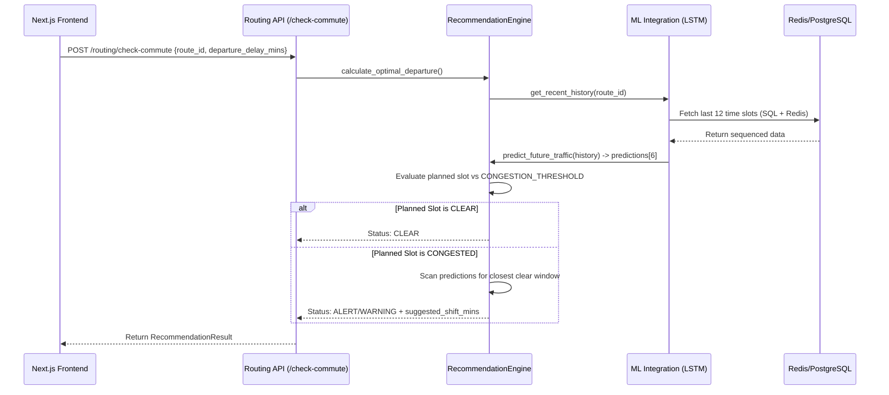

# Feature 01: Active Traffic Optimization

## 1. System Overview
Active Traffic Optimization is the core decision-making engine of the Traffic Brain system. Rather than simply routing a user along the shortest geographical path, this feature analyzes both historical and forecasted traffic volumes to proactively recommend *when* a user should depart to avoid impending congestion.

## 2. Architecture & Data Flow



## 3. Deep Code Trace
The optimization logic heavily resides in `backend/core/recommendation.py`.

1. **Input Transformation**: The user requests a route and provides an intended departure delay in minutes (e.g., leaving in 15 minutes). This is converted into a 5-minute index block: `departure_index = request.departure_delay_mins // 5`.
2. **Forecast Retrieval**: The system queries the PyTorch LSTM model for a 30-minute prediction array `[vol0, vol5, vol10, vol15, vol20, vol25]`.
3. **Threshold Evaluation**: The system compares `predictions[departure_index]` against `settings.CONGESTION_THRESHOLD_VOLUME` (default 1000).
4. **Alternative Discovery**: If congested, the engine loops through the prediction array searching for any index where the volume is below the threshold.
5. **Shift Calculation**: If a clear window is found, it calculates the closest temporal shift: `shift_intervals = closest_idx - planned_departure_index`. It multiplies by 5 to return the exact minute shift required (e.g., `-10` means leave 10 minutes earlier, `+15` means delay departure by 15 minutes).

## 4. API Contract

**Endpoint:** `POST /api/v1/routing/check-commute`

**Request Payload:**
```json
{
  "user_id": "string (JWT extracted or provided)",
  "route_id": "string (e.g., cam_main_01)",
  "departure_delay_mins": 15
}
```

**Response Payload (Success/Alert):**
```json
{
  "status": "ALERT",
  "message": "HEAVY TRAFFIC PREDICTED. Leave 10 mins earlier to save time.",
  "predicted_volume": 1250,
  "suggested_shift_mins": -10,
  "orchestration_mode": "Balanced",
  "anon_trace": "hashed_user_id_string"
}
```

## 5. Failure Modes & Fallbacks
- **ML Engine Offline:** If the PyTorch model (`ml_brain`) fails to load during boot, the engine gracefully degrades, returning `{"status": "error", "message": "ML Engine offline."}`. The frontend catches this and displays a neutral, degraded UI state rather than crashing.
- **Virtual Camera Fallback:** If `route_id` starts with `cam_virtual`, meaning no physical hardware monitors the route, the system bypasses the ML engine and uses a hardcoded mathematical time-of-day curve (`_synthetic_volume`) to provide an estimated location-agnostic forecast.
- **Total Gridlock:** If every 5-minute block in the 30-minute forecast exceeds the congestion threshold, the engine returns a `WARNING` status with `suggested_shift_mins: 0`, informing the user that the entire window is jammed and delays are unavoidable.

## 6. Configuration Variables
- `CONGESTION_THRESHOLD_VOLUME` (int): The hard limit at which a route is flagged as jammed.
- `SEQ_LEN` (int): The number of historical 5-minute blocks required by the ML model (default 12, or 1 hour of data).
