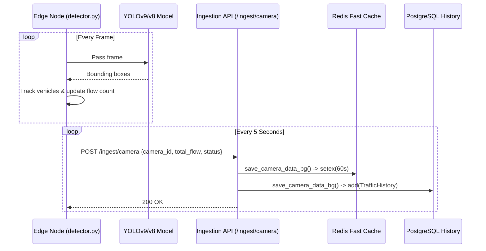

# Feature 02: Edge AI Camera Ingestion

## 1. System Overview
The Edge AI Camera Ingestion system allows physical, low-power edge nodes (e.g., Raspberry Pis, Jetson Nanos, or dedicated local machines) to run heavy computer vision tasks locally. They detect vehicles using YOLO, calculate traffic flow, and periodically push lightweight JSON telemetry to the central Traffic Brain backend.

## 2. Architecture & Data Flow



## 3. Deep Code Trace
The edge node logic resides in `traffic_engine/detector.py`, while the backend receiver is in `backend/api/ingestion.py`.

1. **Edge Detection:** The edge script initializes a YOLO model. It captures frames from a video stream or physical webcam. It uses `cv2` to draw tripwires or tracking zones. As object centers cross the tripwire, a local integer counter (`total_flow`) is incremented.
2. **Telemetry Push:** A background thread in the edge node awakes periodically (e.g., every 5 seconds) and calculates a simplistic status string based on the current flow rate (`CLEAR`, `MODERATE`, `CONGESTED`). It packages this into a JSON payload and HTTP POSTs it to the backend.
3. **Backend Reception:** The FastAPI `/camera` endpoint receives the payload. It uses Pydantic (`CameraPayload`) to strictly validate data types. 
4. **Background Task Offloading:** To prevent the API from blocking and to handle thousands of concurrent edge cameras, FastAPI offloads the actual database write using `BackgroundTasks`. The API immediately returns a 200 OK to the edge node.
5. **Dual-Write Pipeline:** The background task (`save_camera_data_bg`) writes the data to two places:
   - **Redis:** Stores the live state with a 60-second TTL (`setex`) for instant frontend access.
   - **SQL (PostgreSQL/SQLite):** Appends a permanent historical record for future ML model training.

## 4. API Contract

**Endpoint:** `POST /api/v1/ingest/camera`

**Headers:**
- `Authorization`: `Bearer <JWT_TOKEN>`

**Request Payload:**
```json
{
  "camera_id": "cam_main_01",
  "total_flow": 145,
  "status": "MODERATE",
  "latitude": -17.8292,
  "longitude": 31.0522
}
```

**Response Payload:**
```json
{
  "status": "success",
  "message": "Ingest queued for cam_main_01"
}
```

## 5. Failure Modes & Fallbacks
- **Edge Node Disconnection:** If the edge node loses internet, the backend's Redis cache for that camera will expire after 60 seconds (`setex` TTL). The frontend will subsequently notice the camera is missing from the `/state` endpoint and fall back to displaying synthetic historical data.
- **SQL Database Unreachable:** If the SQL transaction fails during the background task, the system catches the `Exception`, performs an `SQLAlchemy db.rollback()`, and logs the error. Crucially, the Redis update still succeeds, ensuring the live frontend map continues to function perfectly even if historical logging drops data.
- **Invalid Payload:** If an edge node sends a malformed JSON or the wrong data types, FastAPI's Pydantic validation automatically intercepts it, blocks the request, and returns an HTTP 422 Unprocessable Entity, preventing database corruption.

## 6. Configuration Variables
- `YOLO_MODEL_PATH`: Path to the local weights file (e.g., `yolov8n.pt`).
- `CAMERA_POLL_INTERVAL`: The frequency at which the edge node pushes data to the cloud.
- `REDIS_CAMERA_TTL`: The exact seconds before a camera is considered "dead" by the backend cache (default 60).
