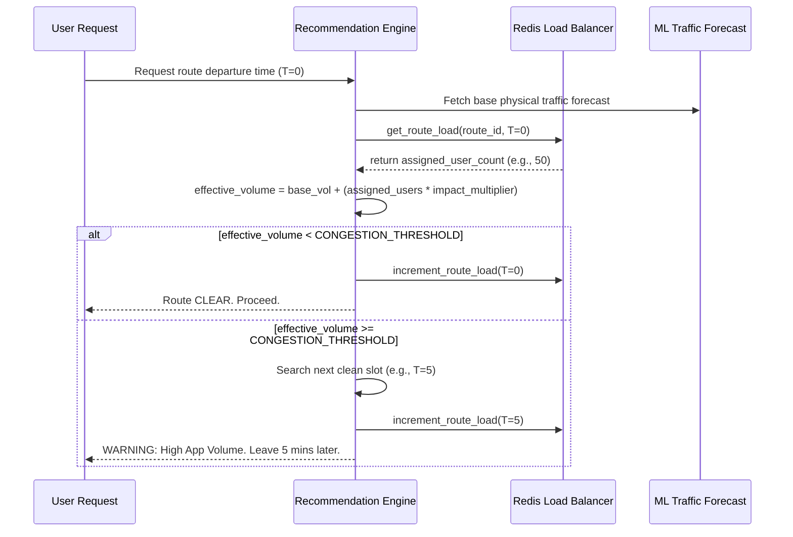

# Feature 03: System Orchestration

## 1. System Overview
System Orchestration (Load Balancing & Departure Staggering) exists to solve the classic "Waze Problem." If an AI traffic system simply tells every user to take the same empty alternate route, it immediately creates a new traffic jam. To prevent this, the backend actively tracks how many users have been assigned to specific time slots and routes, mathematically inflating the "virtual load" of that route. When too many users are assigned the same time slot, the system automatically staggers subsequent users into later departure windows.

## 2. Architecture & Data Flow



## 3. Deep Code Trace
The orchestration logic resides inside `backend/core/recommendation.py` and `backend/core/redis.py`.

1. **Virtual Load Lookup:** When `calculate_optimal_departure` evaluates a planned time slot, it first fetches the base ML prediction (`planned_volume`). It then queries Redis: `redis_manager.get_route_load(route_id, planned_departure_index)`.
2. **Impact Multiplication:** One app user doesn't equal one car—it represents intent. The system multiplies the returned user count by an impact multiplier (default `5`) to calculate the `virtual_load`.
3. **Effective Volume:** The engine calculates `effective_volume = planned_volume + virtual_load`. 
4. **Staggering Iteration:** If `effective_volume` exceeds the `CONGESTION_THRESHOLD_VOLUME`, the AI considers the route jammed—even if the physical street is currently empty. It then iterates forward through the 30-minute prediction array, calculating the `effective_volume` for every future slot until it finds one below the threshold.
5. **Slot Reservation:** Once a clean slot is found, it "reserves" it by calling `redis_manager.increment_route_load(route_id, closest_idx)`. 

## 4. API Contract
Orchestration responses are delivered via the standard `/routing/check-commute` endpoint. The client can distinguish between a natural traffic jam and a system-enforced staggered departure via the `orchestration_mode` field.

**Response Payload (Staggered Load Balance):**
```json
{
  "status": "WARNING",
  "message": "ROUTE LOAD BALANCING: High app user volume. Leave 10 mins later to stagger departure.",
  "predicted_volume": 400,
  "suggested_shift_mins": 10,
  "orchestration_mode": "Staggered",
  "anon_trace": "hashed_user_id_string"
}
```

## 5. Failure Modes & Fallbacks
- **Redis Offline:** The load balancing system strictly relies on the `RedisManager`. If the Redis server crashes, the manager falls back to an in-memory Python dictionary (`self._route_load_fallback`). The orchestration continues to function perfectly for that single API server instance, though distributed scaling across multiple API workers would degrade until Redis is restored.
- **Extreme User Load:** If the user volume is so high that *every* 5-minute slot in the entire 30-minute forecast array is artificially filled to capacity, the system stops staggering and returns a fallback response: `"Heavy traffic for the entire 30-min window. Expect delays."`

## 6. Configuration Variables
- `CONGESTION_THRESHOLD_VOLUME`: The maximum combined (physical + virtual) volume allowed before staggering begins.
- `Impact Multiplier (Hardcoded 5)`: Defines how aggressively the system staggers users. A higher multiplier means users are staggered more rapidly.
- `Load TTL (Hardcoded 1800s)`: The Redis expiration timer for load tracking keys, ensuring load naturally "drains" after 30 minutes without manual cleanup.
