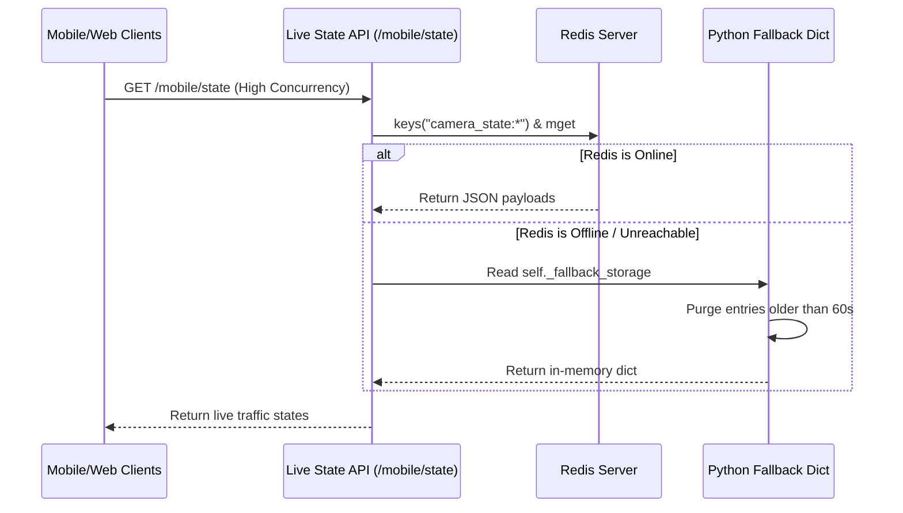

# Feature 04: Ultra-Fast State Memory (Redis)

## 1. System Overview
The Redis State Manager acts as the ultra-fast, in-memory nervous system of the backend. While PostgreSQL handles historical logging for ML training, Redis provides instant, sub-millisecond access to the live status of every traffic camera across the city. This allows the backend to support massive concurrency (e.g., millions of mobile users pinging the `/state` endpoint simultaneously) without bottlenecking a traditional SQL database.

## 2. Architecture & Data Flow



## 3. Deep Code Trace
The core logic resides in `backend/core/redis.py` utilizing the Singleton pattern.

1. **Initialization:** On server boot, `redis_manager = RedisManager()` is instantiated once. It attempts to ping the Redis host. If it fails, it logs a warning and sets `self.redis_client = None`, seamlessly entering fallback mode.
2. **Writing Data (`set_camera_state`):** When edge cameras push telemetry, the data is serialized via `json.dumps`. The critical step is using Redis `setex` (Set with Expiration). The key is set to expire in 60 seconds. This guarantees that if a camera crashes and stops sending data, it automatically disappears from the live map—no cleanup cron jobs required.
3. **Reading Data (`get_all_camera_states`):** The API fetches all live keys matching the `camera_state:*` pattern. It loops through them, parses the JSON, and constructs a live map dictionary. 
4. **Fallback Mechanics:** If Redis is down, writes are stored in `self._fallback_storage` with an injected `_timestamp`. When reads occur, the manager dynamically loops through the dictionary, manually deleting any keys where `time.time() - timestamp > 60` before returning the data, mimicking the `setex` behavior.

## 4. API Contract
The Redis layer doesn't have an external API, but it heavily dictates the internal response of the `/mobile/state` endpoint.

**Backend Internal Call:**
```python
live_data = redis_manager.get_all_camera_states()
# Returns:
{
  "cam_main_01": {
    "camera_id": "cam_main_01",
    "total_flow": 342,
    "status": "MODERATE",
    ...
  }
}
```

## 5. Failure Modes & Fallbacks
- **Redis Connection Refused:** This is the primary failure mode the class is designed for. If the Redis container crashes or the port is blocked, the `RedisManager` intercepts the `ConnectionError` entirely. The entire application continues running smoothly using Python dictionaries. The only trade-off is that in a multi-worker production environment (e.g., Gunicorn with 4 workers), the workers will no longer share state, resulting in slight UI inconsistencies until Redis returns.
- **Stale Data Accumulation:** Because of the strict 60-second TTL (in both Redis and the memory fallback), stale data accumulation is mathematically impossible. A camera state is either less than 60 seconds old, or it ceases to exist.

## 6. Configuration Variables
- `REDIS_HOST`: The hostname or IP of the Redis server (default: `localhost` or `redis`).
- `REDIS_PORT`: The port for the Redis server (default: `6379`).
- `TTL_SECONDS`: The hardcoded expiration time for live camera states (60 seconds) and route load balancing data (1800 seconds).
