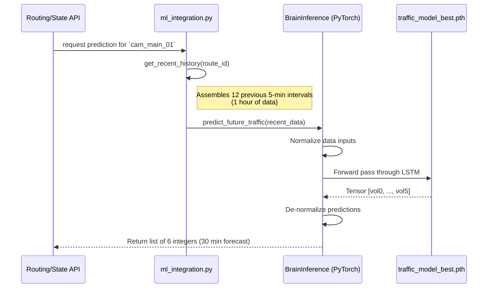

# Feature 05: Predictive Modeling (LSTM Brain)

## 1. System Overview
The Predictive LSTM (Long Short-Term Memory) Brain is the artificial intelligence engine responsible for forecasting future traffic conditions. Unlike basic algorithmic models, this neural network understands the temporal dynamics of traffic buildup—it can recognize that a sudden drop in speed coupled with rising volume indicates a severe, cascading traffic jam before it fully materializes.

## 2. Architecture & Data Flow



## 3. Deep Code Trace
The inference engine sits in `traffic_engine/ml/inference.py`.

1. **Initialization:** On server boot, `BrainInference` initializes the PyTorch environment. It loads the `traffic_model_best.pth` weights and, crucially, a `model_metadata.txt` file which contains the `max_vol` scalar. This scalar is required to perfectly reverse the normalization applied during training.
2. **Sequence Requirements:** The model strictly demands a sequence length of 12 (representing the last 60 minutes of data, at 5-minute intervals). If a camera just booted up and only has 3 data points, the `get_recent_history` function automatically prepends synthetic curve data to satisfy the tensor shape without crashing the model.
3. **Normalization Pass:** Inside `predict_future_traffic`, the raw data `[volume, speed, hour, day]` is normalized. Volume is divided by `max_vol`, speed by 75.0, hour by 23.0, and day by 6.0. This compresses all features into a 0.0–1.0 range, stabilizing the LSTM gradients.
4. **Tensor Execution:** The nested list is converted into a PyTorch FloatTensor, a batch dimension is added (`.unsqueeze(0)`), and it is pushed to the GPU/CPU. `torch.no_grad()` is explicitly called to prevent memory leaks during inference.
5. **De-normalization:** The resulting tensor outputs normalized predictions. The engine multiplies them by `max_vol` to convert them back into tangible vehicle counts.

## 4. API Contract
The ML model is abstracted away from external clients, but it provides a clean internal Python API.

**Internal Function Signature:**
```python
def predict_future_traffic(self, recent_data: list) -> list:
    # Expects: [[vol, spd, hr, day], ...] (Exactly 12 elements)
    # Returns: [pred_vol_0, pred_vol_1, ..., pred_vol_5]
```

## 5. Failure Modes & Fallbacks
- **Model Weights Missing:** If `traffic_model_best.pth` is accidentally deleted or corrupted, the `BrainInference` class does not crash. It catches the error, logs a critical warning, and instantiates the neural network with randomized, untrained weights. While the predictions will be garbage, the backend API will not crash, allowing the system to boot and gracefully handle requests.
- **Metadata Missing:** If the normalization scalar (`model_metadata.txt`) is missing, it falls back to a hardcoded `max_vol = 1000.0` to ensure de-normalization mathematics don't throw ZeroDivisionErrors.
- **CUDA Out of Memory:** The engine uses a dynamic device selector: `torch.device('cuda' if torch.cuda.is_available() else 'cpu')`. If GPU memory is exhausted or drivers fail, it seamlessly runs inference on the CPU.

## 6. Configuration Variables
- `model_path`: Location of the `.pth` weights file.
- `metadata_path`: Location of the `.txt` scalar file.
- `seq_length` (int): Number of input time steps (default 12).
- `pred_length` (int): Number of output predicted time steps (default 6).
