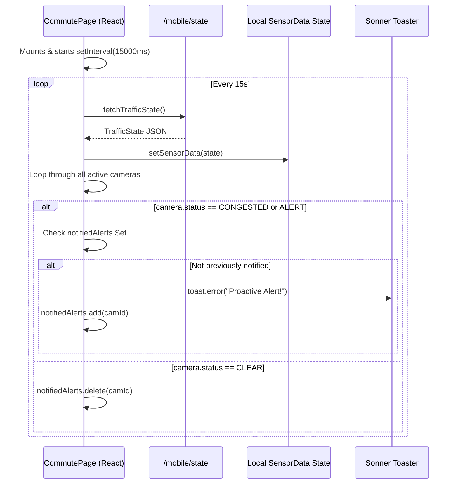

# Feature 06: Proactive Background Monitoring

## 1. System Overview
Traditionally, routing apps require users to actively request a route before warning them of traffic. The Traffic Brain implements Proactive Background Monitoring, a frontend-driven engine that silently polls global city state in the background. If a severe traffic anomaly is detected, it pushes a high-visibility toast alert to the user even if the app is just idling on the dashboard.

## 2. Architecture & Data Flow



## 3. Deep Code Trace
The proactive engine is implemented inside a `useEffect` hook in `app/commute/page.tsx`.

1. **Initialization:** When the `<CommutePage>` mounts, it creates an empty `Set` stored in a `React.useRef`. This reference (`notifiedAlerts`) persists across re-renders without triggering them, making it perfect for tracking spam limits.
2. **Polling Loop:** A `setInterval` is instantiated to execute `pollTraffic()` every 15,000 milliseconds. 
3. **Data Fetching:** It calls `fetchTrafficState()` from `lib/api.ts`, which hits the backend `/state` endpoint, returning the live status of all city nodes.
4. **Evaluation:** It iterates through `Object.entries(state.cameras)`. If it detects `CONGESTED` or `ALERT`, it evaluates the `notifiedAlerts` Set.
5. **Toast Execution:** If the `camId` is not in the Set, it maps the raw `camId` to a human-readable label using the `CAMERA_NODES` array (e.g., "cam_02" -> "Borrowdale Rd"). It then triggers a premium `sonner` toast error.
6. **Self-Healing State:** To ensure the user can be warned again if traffic clears and then rebuilds later, the engine actively calls `notifiedAlerts.delete(camId)` whenever a camera's status returns to `CLEAR` or `MODERATE`.

## 4. API Contract
The proactive engine relies on the existing `/state` polling mechanism.

**Frontend Interface (`TrafficState`):**
```typescript
export interface TrafficState {
  vehicle_count: number;
  congestion_status: "CLEAR" | "MODERATE" | "CONGESTED" | "UNKNOWN";
  cameras: Record<string, CameraData>;
  predictions?: Record<string, number[]>;
  backend_online: boolean;
  error: string | null;
}
```

## 5. Failure Modes & Fallbacks
- **Backend Offline:** If the backend is unreachable or returns a 500 error, `state.backend_online` evaluates to `false`. The polling loop detects this and skips the evaluation block entirely, preventing the app from crashing or spamming blank alerts.
- **Memory Leaks:** The `setInterval` is strictly bound to the component lifecycle via the `useEffect` cleanup return `() => clearInterval(interval);`. If the user navigates away from the Commute page, the polling engine is safely destroyed.
- **Node Dictionary Mismatch:** If the backend pushes a `camId` that does not exist in the hardcoded frontend `CAMERA_NODES` dictionary, the engine falls back to displaying the raw `camId` string rather than throwing a null-pointer exception.

## 6. Configuration Variables
- `Polling Interval` (Hardcoded): `15000` ms (15 seconds).
- `Toast Duration`: Set to 10 seconds to ensure high visibility without permanently blocking the UI.
