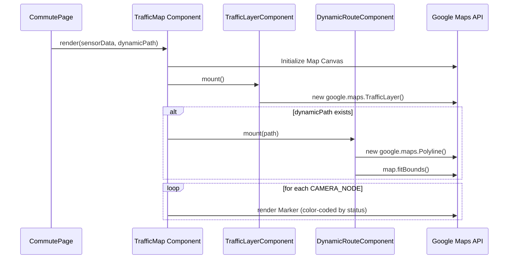

# Feature 07: Dynamic Mapping Interface

## 1. System Overview
The dynamic mapping interface is the visual core of the Traffic System. Built on top of the `@vis.gl/react-google-maps` library, it translates raw JSON traffic telemetry and polyline arrays into a rich, interactive, color-coded visual experience that rival professional navigation tools.

## 2. Architecture & Data Flow



## 3. Deep Code Trace
The mapping logic is encapsulated within `components/TrafficMap.tsx`.

1. **Map Initialization:** The core `<Map>` component is provided by `@vis.gl`. It requires a `defaultCenter` and `defaultZoom`. It specifically sets `disableDefaultUI={true}` to hide clunky native Google controls, relying instead on our custom, glassmorphic UI overlay.
2. **Native Traffic Layer:** A sub-component `TrafficLayerComponent` hooks into the map instance via `useMap()`. Upon mount, it instantiates `new window.google.maps.TrafficLayer()` and binds it to the map. This provides the default red/green Google traffic lines as a basemap.
3. **Polyline Decoding & Rendering:** When a user requests a route, the Google Routes API returns an `encodedPolyline` string. In `app/commute/page.tsx`, a custom `decodePolyline` algorithm translates this ASCII string back into an array of `LatLngLiteral` objects. This array is passed to `DynamicRouteComponent`, which draws a heavy, highly visible blue stroke (`#2563eb`, weight 7) across the map.
4. **Auto-Framing (`fitBounds`):** Crucially, the `DynamicRouteComponent` instantiates a `LatLngBounds` object, iterates over every point in the path to expand the bounds, and executes `map.fitBounds()`. This automatically animates the camera to perfectly frame the user's journey.
5. **Node Injection:** The component merges the static `CAMERA_NODES` definitions with the live `sensorData` passed from the backend. It maps over the resulting array to render Google `<Marker>` components, appending the live AI status (e.g., `CBD North: CONGESTED`) to the tooltip.

## 4. Component Interface
```typescript
interface TrafficMapProps {
  sensorData: {
    vehicle_count: number;
    congestion_status: CongestionStatus;
    cameras: Record<string, CameraData>;
    backend_online: boolean;
  };
  dynamicPath?: google.maps.LatLngLiteral[];
}
```

## 5. Failure Modes & Fallbacks
- **API Key Missing:** If the `NEXT_PUBLIC_GOOGLE_MAPS_API_KEY` is invalid or missing, the Map component catches the loading error and displays a generic grey fallback div, preventing the entire React tree from crashing.
- **Geolocation Denied:** The component attempts `navigator.geolocation.getCurrentPosition` on mount. If the user denies permission, the `onError` callback safely ignores it, and the map defaults to the hardcoded `center` coordinate (Harare CBD).
- **Missing Sensor Data:** If the backend is offline and `sensorData` is null, the node merger logic utilizes the `defaultStatus` defined in `CAMERA_NODES` (e.g., `UNKNOWN`), gracefully degrading the UI without breaking the render cycle.

## 6. Configuration Variables
- `NEXT_PUBLIC_GOOGLE_MAPS_API_KEY`: Required in `.env.local` to authenticate requests.
- `Content-Security-Policy`: Strictly defined in `app/layout.tsx` to permit `unsafe-eval` and specific Google domains, required to prevent the browser from blocking map script execution.
