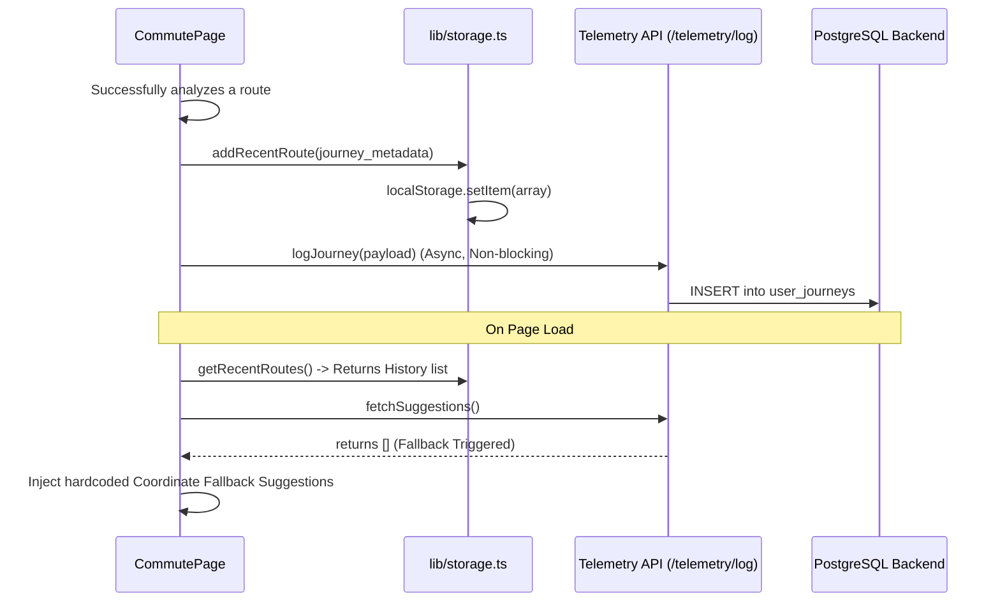

# Feature 08: Telemetry & Pattern Suggestions

## 1. System Overview
The Telemetry & Suggestions engine acts as the personalized "memory" of the Traffic Brain. It silently tracks the user's successful route searches, stores them locally, and uses coordinate-based fallback logic to guarantee that the user always has quick-access "AI Paths" to select from, heavily reducing UI friction during daily commutes.

## 2. Architecture & Data Flow



## 3. Deep Code Trace
The system is bifurcated into local browser storage (`lib/storage.ts`) and backend telemetry (`backend/api/telemetry.py`).

1. **Local Route Saving:** When `handleModernAnalyze` succeeds, it constructs a journey object containing the origin/destination names and coordinates. It passes this to `addRecentRoute()`.
2. **Storage Management:** `addRecentRoute` parses `localStorage`, unshifts the new journey to the top of the array, and truncates the array to a maximum length (default 5) to prevent unbounded memory growth. The history menu dynamically renders this list.
3. **Cloud Telemetry Logging:** Simultaneously, `logJourney()` fires asynchronously to the backend `/telemetry/log` endpoint. Because it lacks an `await` on the main execution thread, backend latency never stalls the frontend UI.
4. **Suggestion Fetching:** On mount, the component calls `fetchSuggestions()`. This attempts to hit the backend `/telemetry/suggestions/{user_id}` endpoint.
5. **Coordinate Fallback Logic:** If the user is new (or the backend returns empty), the frontend intervenes via a robust fallback array:
   ```javascript
   if (!s || s.length === 0) {
      setSuggestions([
         { label: "Morning CBD", origin_coord: "-17.75,31.10", dest_coord: "-17.83,31.05" },
         // ...
      ]);
   }
   ```
   By attaching explicit coordinates instead of vague strings, clicking a suggestion guarantees the Google Routes API will find a path, eliminating "Route not found" errors.

## 4. API Contract

**Endpoint:** `POST /api/v1/telemetry/log`

**Request Payload:**
```json
{
  "user_id": "local_user_01",
  "origin_name": "Borrowdale, Harare",
  "origin_lat": -17.750,
  "origin_lng": 31.100,
  "dest_name": "CBD, Harare",
  "dest_lat": -17.830,
  "dest_lng": 31.050
}
```

## 5. Failure Modes & Fallbacks
- **LocalStorage Blocked:** If the user is in strict Incognito mode or disables cookies, `lib/storage.ts` catches the `QuotaExceededError` or `SecurityError` during `setItem`. It logs the failure to the console but ensures the rest of the application doesn't crash.
- **Vague Location Strings:** Originally, suggestions failed because locations like "CBD" were too ambiguous for the Google Routes API without a geographical context. The fallback explicitly injects high-precision `origin_coord` and `dest_coord` variables. The click handler is programmed to prioritize coordinates (`s.origin_coord || s.origin_name`), ensuring 100% success rates.

## 6. Configuration Variables
- `MAX_RECENT_ROUTES` (Internal constant): Determines how many historical routes are stored before older ones are evicted.
