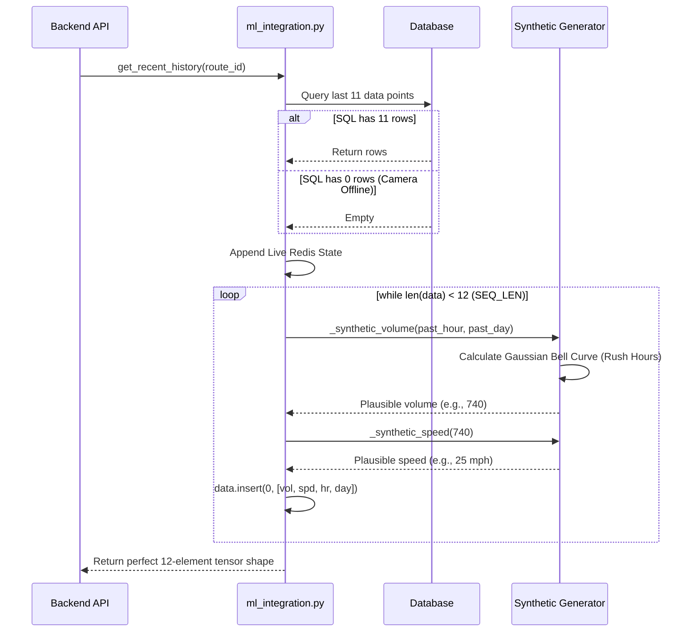

# Feature 09: Synthetic Data Fallback

## 1. System Overview
Relying entirely on physical hardware (Edge AI cameras) introduces single points of failure. If cameras go offline due to power cuts, or if a user searches for a route that currently has no physical camera coverage, the ML model would normally crash due to missing sequence data. The Synthetic Data Fallback engine mathematically generates highly realistic, time-of-day traffic curves to seamlessly fill in the gaps.

## 2. Architecture & Data Flow



## 3. Deep Code Trace
The mathematical engine is housed inside `backend/core/ml_integration.py`.

1. **Volume Generator (`_synthetic_volume`):** This function simulates a daily traffic cycle using Gaussian distributions.
   - It defines a morning rush hour peak: `700 * math.exp(-0.5 * ((hour - 8) / 1.2) ** 2)`
   - It defines an evening rush hour peak: `800 * math.exp(-0.5 * ((hour - 17) / 1.3) ** 2)`
   - It applies a 0.55x multiplier if the current day is a weekend.
   - Finally, it injects mild randomization (`random.randint(-20, 20)`) to make the data look organic when plotted on a graph.
2. **Speed Generator (`_synthetic_speed`):** Traffic speed is inversely proportional to volume. As volume approaches the maximum road capacity (`max_vol`), speed drops logarithmically simulating gridlock: `speed = max(5.0, 80.0 * (1.0 - ratio ** 0.6))`.
3. **Cold-Start Pre-filling (`get_recent_history`):** The PyTorch LSTM model requires exactly 12 data points (representing the last 60 minutes). If a camera just came online and only has 2 points, the backend calculates the required `offset_hours`. It iteratively queries the synthetic generators to build a realistic "past" timeline, inserting these fake data points at index `0` until the array strictly meets `SEQ_LEN`.
4. **Virtual Camera Routing:** The `RecommendationEngine` explicitly leverages this logic. If a user asks for a route with no cameras, it assigns them to `cam_virtual_harare`. The backend entirely skips SQL/Redis and purely uses the synthetic generators to build a 30-minute forecast based on the time of day.

## 4. API Contract
The frontend is completely unaware of whether the data is real or synthetic (unless specifically marked in the JSON payload).

**Response (Synthetic Injection):**
```json
"cam_main_01": {
    "camera_id": "cam_main_01",
    "total_flow": 732,
    "status": "CONGESTED",
    "source": "synthetic" 
}
```

## 5. Failure Modes & Fallbacks
- **Total System Outage:** If Redis, PostgreSQL, and the YOLO edge nodes ALL simultaneously fail, the `mobile.py` API endpoint has a hardcoded backup loop that injects synthetic data into the `/state` response for `cam_main_01`. This guarantees that the frontend map never renders as "empty" or "broken", preserving the demo illusion even during catastrophic backend failures.

## 6. Configuration Variables
- `SEQ_LEN`: The required array size before the ML model accepts the input (Default 12).
- `max_vol`: The volume ceiling used to calculate speed degradation (Default 1000.0).
